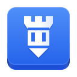
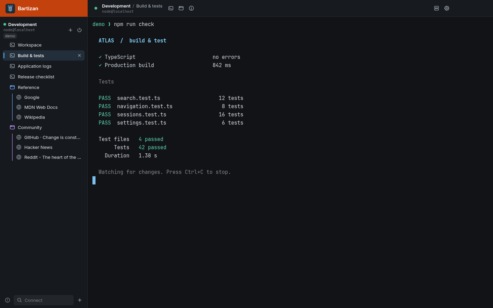

<p align="center">
  
</p>
<h1 align="center">Bartizan</h1>
<p align="center">SSH terminals and web browsing through the same connection.</p>
<p align="center">
  <a href="https://github.com/ryanpetris/bartizan/releases/latest">Download for Linux</a> ·
  <a href="docs/README.md">Documentation</a> ·
  <a href="docs/development.md">Development</a>
</p>



Keep a shell, build output, logs and browser tabs together for each remote connection. Bartizan is an open source Linux desktop app built on your installed OpenSSH client.

- Open several terminals over one SSH connection.
- Browse through the connection's SOCKS forward, including DNS lookups. If SSH drops, browser traffic stops until you reconnect.
- Keep separate browser sessions with their own in-memory cookies and site storage.
- Save connection profiles, search by tags and arrange your connections to match your work.
- Choose your fonts and theme, with terminal ligatures and JetBrains Mono bundled.

Bartizan keeps its own SSH configuration and trust store. Your existing SSH configuration and known hosts stay untouched.

## Install

Download the latest release for Linux x86-64:

| Package | Format |
| --- | --- |
| AppImage | `.AppImage` |
| Debian / Ubuntu | `.deb` |
| Arch Linux | `.pkg.tar.zst` |
| Archive | `.tar.gz` |

**[Get Bartizan →](https://github.com/ryanpetris/bartizan/releases/latest)**

You need OpenSSH and a working Chromium sandbox. See the [installation guide](docs/installation.md) for package commands and requirements.

## Get Connected

Open **New Connection**, enter your SSH details and connect. Use the connection's add menu for more terminals or a browser session. Each browser session can hold several tabs, and its traffic goes through that connection.

Save a profile to connect again from Connect. Profiles can also inherit shared defaults in a [YAML configuration file](docs/configuration.md).

See [Using Bartizan](docs/usage.md) for browser sessions, terminal controls and keyboard shortcuts.

## Develop

With Node.js 24 or newer, npm, OpenSSH, Python, make and a C++ compiler installed:

```sh
npm install
npm start
```

The [development guide](docs/development.md) covers tests, end-to-end rigs and packaging. See [Architecture](docs/architecture.md) for how the app works.

## License

[MIT](LICENSE)
